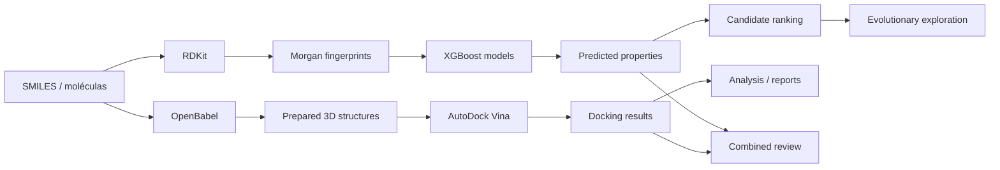

# Molecule Generation & Virtual Screening Suite

Suite experimental de **química computacional e Machine Learning** voltada a triagem virtual, docking molecular, predição de propriedades e exploração de novas moléculas candidatas.

O repositório consolida dois fluxos principais:

1. **Biolab** — preparação, docking e análise de candidatos usando AutoDock Vina/OpenBabel;
2. **formolecular** — featurização molecular, modelos XGBoost e exploração evolucionária com RDKit.

> Este projeto é um ambiente computacional de pesquisa e experimentação. Scores de docking e predições de ML **não equivalem a evidência clínica, farmacológica ou experimental** e não devem ser usados isoladamente para decisões médicas ou laboratoriais.

## Pipeline

| Etapa | Tecnologia | Papel no fluxo |
|---|---|---|
| representação molecular | SMILES / estruturas 3D | entrada dos compostos |
| featurização | RDKit / Morgan Fingerprints | transformar estrutura em representação numérica |
| predição | XGBoost / Scikit-learn | estimar propriedades e priorizar candidatos |
| preparação química | OpenBabel | conversão/preparação de formatos para docking |
| docking | AutoDock Vina | estimar poses e scores receptor-ligante |
| seleção | filtros + algoritmo evolucionário | priorizar e explorar novas moléculas candidatas |
| análise | Pandas / NumPy / visualização | consolidar resultados e comparar candidatos |

## Arquitetura



## Estrutura do repositório

```text
molecule-generation-suite/
├── Biolab/
│   ├── fabrica_g2.py            # pipeline principal de docking
│   ├── coletor_admet.py         # coleta/processamento de propriedades
│   ├── analiseFinal.py          # consolidação e classificação
│   ├── TOP_10_HITS_REFINADOS.csv
│   └── *.pdb / *.pdbqt          # estruturas versionadas no projeto
│
└── formolecular/
    ├── g_oraculo_farma.py       # treinamento/predição molecular
    ├── g_oraculo_aeroespacial.py
    ├── treinar_oraculo.py       # retreinamento de modelos
    ├── modelos_ia/              # modelos serializados
    └── novo_horizonte/          # exploração evolucionária
```

## 1. Biolab — virtual screening e docking

O `Biolab` automatiza etapas de preparação, execução e consolidação de docking receptor-ligante.

### Recursos

- integração com **AutoDock Vina**;
- conversão de estruturas com **OpenBabel**;
- execução concorrente com `ProcessPoolExecutor`;
- consolidação de resultados com Pandas;
- geração de heatmaps e gráficos;
- geração automatizada de relatórios técnicos em PDF.

O objetivo é reduzir trabalho manual ao comparar uma coleção de candidatos sob uma configuração de docking definida pelo pesquisador.

## 2. formolecular — modelos preditivos

O `formolecular` usa representações moleculares e modelos supervisionados para estimar propriedades e auxiliar a priorização antes de etapas computacionalmente mais caras.

### Featurização

SMILES são convertidos em **Morgan Fingerprints de 2048 bits** com RDKit.

### Modelagem

Os fluxos usam modelos baseados em **XGBoost** para predição de propriedades e scores definidos pelos datasets de treinamento usados localmente.

Entre as variáveis trabalhadas pelo projeto estão:

- QED;
- LogP;
- TPSA;
- massa molecular;
- aromaticidade;
- H-bond donors/acceptors;
- ligações rotacionáveis;
- outros descritores presentes nos pipelines locais.

### Exploração evolucionária

`novo_horizonte/` contém experimentos de geração/mutação de estruturas e seleção de candidatos conforme funções de score computacionais.

Essa etapa é **exploração de espaço químico**, não descoberta validada de um fármaco.

## Tecnologias

- Python
- RDKit
- XGBoost
- Scikit-learn
- Pandas
- NumPy
- AutoDock Vina
- OpenBabel
- Matplotlib
- Seaborn
- FPDF

## Como reproduzir

O repositório ainda reúne ambientes que nasceram como projetos independentes, portanto a execução depende do subfluxo escolhido.

### Biolab

Pré-requisitos externos:

- Python com as dependências científicas usadas pelos scripts;
- AutoDock Vina disponível localmente;
- OpenBabel (`obabel`) quando a preparação/conversão for necessária.

Pontos de entrada principais:

```text
Biolab/fabrica_g2.py
Biolab/coletor_admet.py
Biolab/analiseFinal.py
```

### formolecular

Pontos de entrada principais:

```text
formolecular/g_oraculo_farma.py
formolecular/g_oraculo_aeroespacial.py
formolecular/treinar_oraculo.py
formolecular/novo_horizonte/
```

Uma melhoria futura importante é consolidar os ambientes em arquivos de dependências reproduzíveis e adicionar datasets de exemplo pequenos que possam ser distribuídos legalmente no repositório.

## Limites científicos

Os resultados devem ser interpretados com cautela:

- docking produz uma aproximação computacional dependente da preparação e configuração escolhidas;
- score de docking não é afinidade experimental medida;
- modelos de ML herdam viés, cobertura e erro dos datasets usados no treinamento;
- boa predição de propriedade não demonstra segurança, eficácia ou biodisponibilidade;
- moléculas geradas precisam passar por validação química e experimental externa;
- nenhum resultado deste repositório substitui estudos in vitro, in vivo ou avaliação especializada.

## Reprodutibilidade e dados

Arquivos muito grandes, binários externos, datasets brutos e ambientes virtuais não são versionados no GitHub.

Exemplos deliberadamente excluídos via `.gitignore` incluem:

- grandes bases CSV de treinamento;
- executáveis/instaladores como Vina e OpenBabel;
- ambientes virtuais;
- arquivos temporários de docking.

Para uma reprodução rigorosa, registre junto ao experimento:

- versão do dataset;
- versão das bibliotecas;
- parâmetros do modelo;
- receptor/ligante e preparação usada;
- caixa e parâmetros do docking;
- seed quando aplicável;
- métricas em conjunto de validação/teste separado.

## Objetivo do projeto

Mais do que produzir um único score, a suite busca estudar como **predição rápida + simulação física + seleção computacional** podem ser combinadas em um pipeline rastreável de priorização de moléculas.
