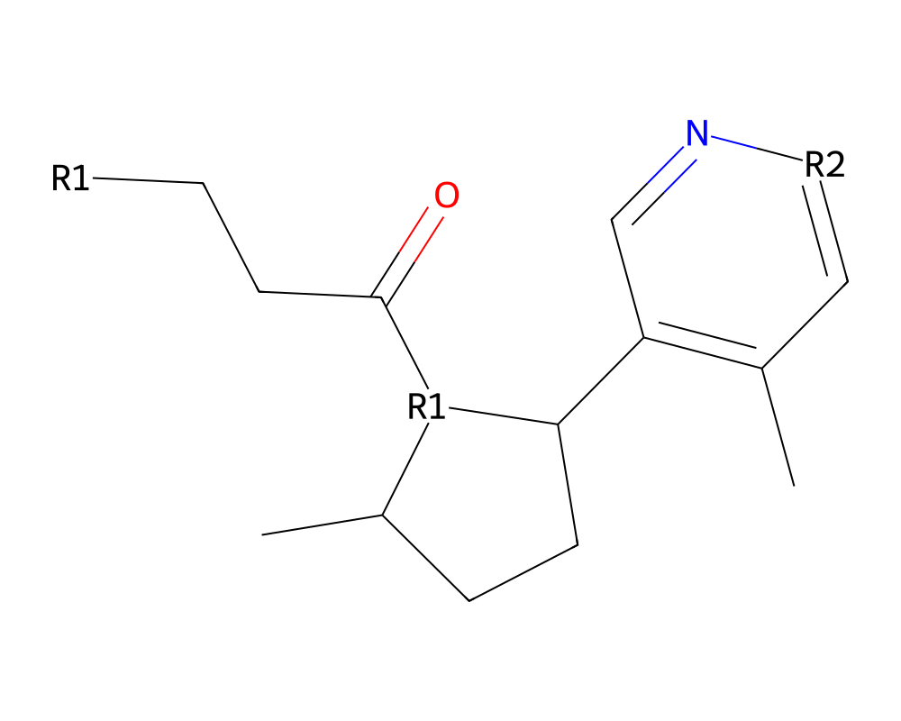
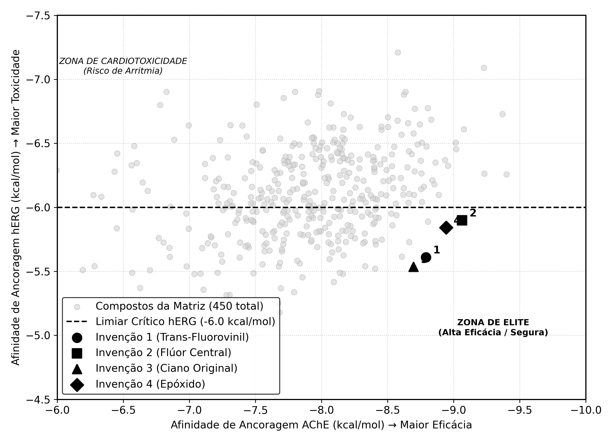

# NOVOS DERIVADOS PIRIDÍNICOS HÍBRIDOS INIBIDORES DE ACETILCOLINESTERASE COM PERFIL DE BAIXA CARDIOTOXICIDADE, PROCESSO DE PREPARAÇÃO E SEUS USOS FARMACÊUTICOS

## Campo da invenção

A presente invenção insere-se no campo da química medicinal e da farmacologia, referindo-se ao desenho estrutural e à proposição de uma nova classe de compostos derivados de piridina. Mais especificamente, a invenção trata de agentes inibidores da enzima Acetilcolinesterase (AChE) concebidos racionalmente para o tratamento de doenças neurodegenerativas, como a Doença de Alzheimer, apresentando simultaneamente um perfil otimizado de segurança cardíaca através da evasão sistemática da inibição do canal de potássio hERG.

## Fundamentos da invenção

O tratamento sintomático da Doença de Alzheimer depende fortemente de inibidores da enzima Acetilcolinesterase (AChE). No entanto, compostos clássicos atuantes no sistema nervoso central frequentemente apresentam limitações clínicas severas devido a efeitos adversos cardiovasculares, notadamente o prolongamento do intervalo QT no eletrocardiograma. Este efeito letal é desencadeado pelo bloqueio *off-target* do canal de potássio codificado pelo gene hERG (KCNH2). 

O estado da técnica carece de inibidores de AChE que possuam modificações periféricas capazes de blindar a molécula contra o canal hERG sem sacrificar a afinidade no sítio ativo da enzima. O problema técnico a ser resolvido, portanto, é a elevada cardiotoxicidade dos compostos inibidores de AChE atuais.

A presente invenção resolve este problema técnico ao propor uma substituição isostérica e eletrônica específica na região periférica da molécula. Ao inserir grupos substituintes rígidos e/ou eletronegativos de baixo volume estérico na extremidade do anel piridínico, combinados a cadeias alifáticas ou fluoradas específicas no núcleo, a invenção proporciona o benefício técnico de um Índice de Seletividade termodinâmico sem precedentes, garantindo alta afinidade pela AChE e mínima interação com o canal hERG, resultando em um medicamento intrinsecamente mais seguro.

## Breve descrição dos desenhos

A Figura 1 ilustra a representação estrutural da Fórmula Geral I (Fórmula de Markush) dos compostos da invenção.
A Figura 2 apresenta o gráfico comparativo do Índice de Seletividade termodinâmico (AChE vs. hERG) dos compostos preferenciais em relação aos padrões de controle.

## Descrição da invenção

A invenção descreve compostos representados pela **Fórmula Geral I** compreendida por: **[R1] - [Núcleo Ciclopentano] - [Anel Piridínico] - [R2]**.

A presente invenção baseia-se num esqueleto de ciclopentano acoplado a um anel de piridina. Onde as restrições e reivindicações estruturais determinam que o grupo **R1** (Vetor de Cauda e Centro) é selecionado do grupo que consiste em cadeias alifáticas lineares ou ramificadas contendo de 4 a 5 átomos de carbono, podendo apresentar uma insaturação (dupla ligação) ou substituição por um átomo de halogênio (Flúor) no anel central adjacente para modulação de dipolo.

O grupo **R2** (Escudo Periférico de Segurança) é o sítio crítico da invenção, devendo ser estritamente selecionado do grupo que consiste em radical ciano (-C#N), radical isocianeto (-[N+]#[C-]), radical trans-fluorovinil (-C=CF) ou anel oxirano/epóxido (-C1CO1). A combinação destas características estruturais impede o encaixe da molécula no canal hERG devido a impedimento estérico e repulsão eletrônica, mantendo a geometria ideal para a inibição da Acetilcolinesterase.

## Exemplos de concretizações da invenção

Abaixo são apresentados exemplos de concretizações preferenciais da invenção, demonstrando os resultados de testes comparativos *in silico* (atracamento molecular e cálculos termodinâmicos) que comprovam as vantagens da invenção em relação à seletividade.

**Tabela 1 - Exemplos Comparativos de Afinidade (kcal/mol) e Índice de Seletividade**

| Compostos | Afinidade AChE | Afinidade hERG | Índice de Seletividade |
| :--- | :---: | :---: | :---: |
| **Invenção 1** (Cauda Pentanoil + Trans-Fluorovinil) | -8.790 | -5.610 | 3.180 |
| **Invenção 2** (Cauda Isopropil com Flúor + Trans-Fluorovinil) | -9.064 | -5.899 | 3.165 |
| **Invenção 3** (Cauda Butanoil + Ciano) | -8.696 | -5.535 | 3.161 |
| **Invenção 4** (Cauda Isopropil + Epóxido) | -8.943 | -5.841 | 3.102 |
| **Controle A** (Sem modificação protetora - Oxima Polar) | -9.400 | -6.258 | 3.142 *(Tóxico)* |

Como demonstrado na Tabela 1, a concretização preferida (Invenção 1) com o grupo trans-fluorovinil alcança altíssima afinidade pela AChE (-8.790) mantendo-se segura contra o canal hERG (-5.610), enquanto variações fora do escopo protetor (Controle A) ultrapassam o limiar crítico de toxicidade cardíaca (-6.000).

 
 

# REIVINDICAÇÕES

**1. COMPOSTO DERIVADO PIRIDÍNICO**, caracterizado por possuir a Fórmula Geral I correspondente a [R1] - [Núcleo Ciclopentano] - [Anel Piridínico] - [R2], seus isômeros, enantiômeros, diastereoisômeros, sais farmaceuticamente aceitáveis e solvatos, onde o substituinte R2 localizado no anel piridínico é obrigatoriamente selecionado entre o grupo consistindo em: radical ciano, radical isocianeto, radical trans-fluorovinil e anel oxirano.

**2. COMPOSTO**, de acordo com a reivindicação 1, caracterizado por o grupo R1 ser uma cadeia alquílica ou alquenílica linear ou ramificada compreendendo de 4 a 5 átomos de carbono, opcionalmente contendo uma substituição de átomo de Flúor no anel de ciclopentano adjacente.

**3. COMPOSTO**, de acordo com a reivindicação 1, caracterizado por ser especificamente o 1-[3-(5-trans-fluorovinil-piridin-3-il)-2-metil-ciclopentil]pentan-1-ona.

**4. COMPOSTO**, de acordo com a reivindicação 1, caracterizado por ser especificamente o 1-[3-(5-ciano-piridin-3-il)-2-metil-ciclopentil]butan-1-ona.

**5. COMPOSIÇÃO FARMACÊUTICA**, caracterizada por compreender uma quantidade terapeuticamente efetiva de pelo menos um composto definido em qualquer uma das reivindicações de 1 a 4, e ao menos um excipiente, transportador ou diluente farmaceuticamente aceitável.

**6. USO DOS COMPOSTOS**, definidos em qualquer uma das reivindicações de 1 a 4, caracterizado por ser para a preparação de um medicamento destinado ao tratamento, prevenção ou mitigação de doenças neurodegenerativas dependentes da inibição da enzima Acetilcolinesterase.

 
 

# DESENHOS

# DESENHOS

**Figura 1**

 

**Figura 2**
 
 

# RESUMO

**NOVOS DERIVADOS PIRIDÍNICOS HÍBRIDOS INIBIDORES DE ACETILCOLINESTERASE COM PERFIL DE BAIXA CARDIOTOXICIDADE, PROCESSO DE PREPARAÇÃO E SEUS USOS FARMACÊUTICOS**

A presente invenção insere-se no setor técnico da química farmacêutica e descreve uma nova família de compostos híbridos baseados em um esqueleto piridínico-ciclopentânico, concebidos racionalmente como inibidores da enzima Acetilcolinesterase (AChE). Os compostos da Fórmula I são caracterizados por modificações na região periférica, notadamente o uso de grupos bioisostéricos compactos, rígidos e eletronegativos, tais como ciano, isocianeto, trans-fluorovinil e oxirano, que conferem elevada estabilidade termodinâmica no sítio ativo da enzima alvo. Simultaneamente, diferindo do estado da técnica atual, tais arranjos estruturais promovem a evasão estérica e eletrônica do bloqueio do canal de potássio hERG, mitigando os riscos de cardiotoxicidade severa comumente associados ao tratamento de patologias neurodegenerativas centrais. A invenção compreende os referidos compostos, seu processo de preparação, composições farmacêuticas e uso para a fabricação de medicamentos mais seguros no controle do déficit colinérgico.